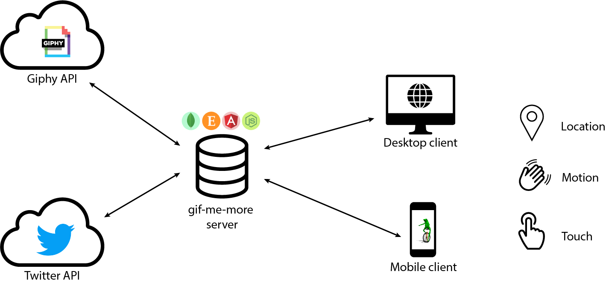

# gif me more


__get gifs from location based twitter trends__

made by @florianporada, 500 768 343,
[repo link](https://github.com/florianporada/gif_me_more/)
(ask for access)

___

Installation
------
- clone repo
- go to the repo and run `npm install`
- start a mongodb instance
- run `npm start`

Documentation
------
The premise of the project was to build a web application which contains the following features:
- implementation of sensors (e.g. geolocation, motion, touch, etc.)
- server-side datasources
- application framework (e.g. AngularJS, Meteor, etc.)
- effective use of layout frameworks (e.g. BootStrap, etc.)

In the next block I will provide information about the structure of the application.

###What it is

This application is a simple way to get the trending topics on twitter based on your current location and search automatically for related gifs (e.g. as reaction to the topic etc...) and share it back on twitter.

###How it works



The whole application is based on the MEAN stack. The local datasource on the server is a mongodb database, which is a NoSql based database. The express middleware provides the web server functionality and for the frontend AngularJS is used. The whole application is NodeJS based.

Additionally the [Twitter](https://dev.twitter.com/rest/public)
twitter and [Giphy](https://api.giphy.com/) API is implemented on the server side.

######__Twitter API__
Through the Twitter API the app is able to get a place id via longitude and latitude information.

`https://api.twitter.com/1.1/trends/closest.json?lat=37.781157&long=-122.400612831116`

gives you back the locations that Twitter has trending topic information for. The response gives you a so called `WOEID` (Yahoo! Where On Earth ID).

With this ID the app makes another call to the Twitter API which provides the trending topics based on the given `WOEID`.

`https://api.twitter.com/1.1/trends/place.json?id=1`

gives you back an array of the trending topics which are the datasource for the later gif search.

######__Giphy API__
After getting the trending topics from twitter the results are used to get related gifs from the Giphy API.
`http://api.giphy.com/v1/gifs/search?q=funny+cat&api_key=dc6zaTOxFJmzC`
gives you back an array with the necessary information to display the image in the frontend.

######__Internal API__
All calls to the external APIs are made by the server and NOT by the client to reduce the overhead for the client and therefore save your mighty precious data volume.

The internal API is a basic __CRUD__ API. (Create, Read, Update, Delete).
Because you can save a gif for later it is necessary to save some data in server side database.

`/api/gifs/` (`/api/gifs/<UUID>`)

for example, is the endpoint for getting, saving or deleting the gifs in the server-side database. It depends on the kind of call you make. A `GET` call gives you back the saved gifs while a `POST` call saves a selected gif.

####__server-side__
As mentioned above the app is based on NodeJS. So the server-side is completely written in JavaScript.

Due the fact that the calls are async the server-side works with promises and callbacks. The following code serves as example for an async call to the Giphy API:

```javascript
function getGiphyGifs(searchTerms) {
  const apiKey = env.GIPHY_API_KEY;
  let apiEndpoint = `http://api.giphy.com/v1/gifs/search?api_key=${apiKey}&q=`;
  let result = [];
  let options = {
    method: 'GET',
    url: apiEndpoint,
    json: true,
    timeout: 10000,
    followRedirect: true,
    maxRedirects: 10
  };

  searchTerms = JSON.parse(searchTerms);

  return new Promise(function(resolve, reject) {
    for(let i = 0; i < searchTerms.length; i++) {
      options.url = apiEndpoint + searchTerms[i];
      request(options, function(err, res, body) {
        if(err) {
          return reject(err);
        }

        result = result.concat(body.data);

        if(i == searchTerms.length - 1) {
          return resolve(result);
        }
      });
    }
  });
}

export function getGifs(req, res) {
  return getGiphyGifs(req.params.search_terms).then(data => {
    res.status(200).send(data);
  });
}
```

####__client-side__


On the client side AngularJS is used as a framework. The first time the app is opened in the browser in makes a call to the server which returns a unique ID, which is saved in you local storage of the used browser. The ID (e.g. `78c62999-0224-4f74-a7f7-2042324b014f`) is necessary to identify you as a user and get the gifs you save.
Every time the app is opened afterwards the ID is send to the server which returns the saved gifs for this ID.

Over the build in features of the browser the __geolocation__ is tracked down and send to the server which then talks to the Twitter API for sending back the trending topics for the location.

By clicking on one topic the associated gifs are displayed and can be saved or shared directly on twitter.

The saved gifs are located on the lower end of the app and can also be shared on twitter or deleted because they are not dank anymore.

__mobile__

The application is fully responsive and therefore usable for mobile phones or tablets.

Another thing is the ability to make use of the feature of the __motion sensor__. By shaking the mobile device the whole page is reloaded.
